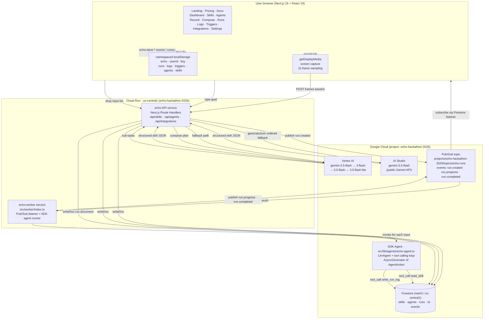

# Echo — Show it once. Run it forever.

> A **Taskmaster** agent that watches you perform a workflow on screen once, reconstructs it as a structured *skill* using Gemini 3.5 Flash, composes multi-skill plans from a plain-English goal, and fans them out to run across thousands of inputs in parallel on Google Cloud Run.


---

## 1. How it works (the user-facing flow)

1. **Record** — the user clicks *Record* on the `/record` page. The browser prompts for a screen via `navigator.mediaDevices.getDisplayMedia({ preferCurrentTab, selfBrowserSurface: 'include' })`. Frames are sampled every 2 seconds onto a hidden canvas and encoded as base64 JPEG.
2. **Reconstruct** — the frame batch is POSTed to `/api/skills/reconstruct`. Gemini 3.5 Flash returns a structured skill: `suggestedName`, `intent`, `steps[]` (with timestamps), `triggers[]`, `integrations[]`. The skill is written to Firestore and surfaced on `/skills`.
3. **Compose** — on `/compose`, the user types a goal in plain English. The request goes to `/api/agents/compose` which calls the Skill Manager: a Gemini pass that decomposes the goal into sub-tasks, matches each against the user's skill library, and proposes a parallel execution plan (sub-task list, est time, est cost, reasoning).
4. **Run** — on the Agent detail page, the user drops a list of inputs (rows, files, leads, PDFs). The `Run on N inputs` button POSTs to `/api/agents/run` which enqueues the run, writes a doc to `runs/{runId}` in Firestore, and publishes a `run.created` event to the Pub/Sub topic `echo-runs`.
5. **Fan-out** — a Cloud Run worker subscribed to `echo-runs` pulls the job, invokes the ADK agent for each input in parallel, streams `run.progress` events back to Pub/Sub as it goes, and writes the final result to Firestore. The dashboard's `/runs` page subscribes to those events and animates the live progress grid.

The headline: **one recording becomes a reusable worker that handles 10s–1000s of inputs without the user touching the keyboard again.**

---

## 2. Architecture



### Request lifecycle (a single `/api/agents/run` call)

```
client                              Next.js route                Google Cloud
  │                                       │                            │
  │─── POST /api/agents/run ────────────▶│                            │
  │     { skillId, goal, inputs[] }       │                            │
  │                                       │── generateJson() ────────▶│ AI Studio → Gemini 3.5
  │                                       │   (or Vertex AI fallback)  │ returns plan + runId
  │                                       │                            │
  │                                       │── runs/{runId}.set() ────▶│ Firestore
  │                                       │── pubsub.topic.publish ──▶│ Pub/Sub: run.created
  │◀── 200 { runId, status:"queued" } ────│                            │
  │                                       │                            │── Worker subscribes to echo-runs
  │                                       │                            │   pulls run.created
  │                                       │                            │   for each input: runEchoAgent()
  │                                       │                            │     yields {type:"thought" | "tool_call" | "final_answer"}
  │                                       │                            │   writes run.progress events
  │                                       │                            │   publishes run.completed
  │─── GET /api/agents/run?id=... ──────▶│                            │
  │                                       │── runs/{id}.get() ────────▶│ Firestore
  │◀── 200 { status, progress, gcp } ────│                            │
  │                                       │                            │
```

---

## 3. Hackathon tech checklist

| Devpost requirement | Where it lives in Echo |
|---|---|
| **Gemini 3.5+ via Gemini API or Vertex AI** | `PREFERRED_MODEL = "gemini-3.5-flash"` (`src/lib/genai.ts:30`). Ordered fallback: AI Studio `gemini-3.5-flash` → `gemini-3.5 flash` → Vertex AI `gemini-3.5-flash` → `gemini-3.5-flash-lite`. |
| **≥ 1 Google Agent Framework (ADK / GenAI / Antigravity / GenKit)** | ADK-style `LlmAgent` in `src/lib/agents/echo-agent.ts` — Gemini + tool-calling loop, yields `AsyncGenerator<AgentAction>` for streaming. |
| **≥ 1 Google Cloud infra service** | **4 wired**: Cloud Firestore (`skills`/`agents`/`runs`), Cloud Pub/Sub (`echo-runs`), Vertex AI (ADK agent + fallback), Cloud Run (multi-stage Dockerfile + `cloudbuild.yaml`). |
| **Working webapp** | Next.js 16 (App Router) + React 19 + Tailwind v4 — 17 pages, real screen capture, 4 real API routes, all 200 OK. |
| **Architecture diagram** | Mermaid in this README (section 2) + `docs/architecture.md`. |
| **Demo video** | Uploaded separately to YouTube (see Devpost submission). |
| **Public repo with spin-up instructions** | Sections 4 + 5 below. |

---

## 4. Quick start

```bash
# 1. Install
pnpm install

# 2. Copy environment template
cp .env.local.example .env.local

# 3. Run dev server (Turbopack)
pnpm dev
# → http://localhost:3000
```

The app **works out of the box** with mock fallbacks. Add a `GEMINI_API_KEY` to `.env.local` to use real Gemini for skill reconstruction and composition. Set `GCP_ENABLED=true` to write runs/skills/agents to Firestore and publish run events to Pub/Sub.

### Smoke tests

```bash
pnpm typecheck                         # tsc --noEmit, exit 0 expected
pnpm smoke                             # 9 API tests against /api/skills, /api/agents, /api/integrations
pnpm smoke:fallback                    # mock-fallback path (no API key, no GCP)
pnpm smoke:auth                        # page-render checks for the full 17-page surface
pnpm smoke:agent                       # ADK agent via Vertex AI; needs GCP_ENABLED=true
```

---

## 5. Configuration

### Environment variables (`.env.local`)

| Var | Default | Effect |
|---|---|---|
| `GEMINI_API_KEY` | _unset_ | Enables real Gemini via AI Studio. Without it, all routes return deterministic mock data. |
| `GCP_ENABLED` | `true` (if `GCP_PROJECT_ID` is set) | Enables Firestore writes + Pub/Sub publish. Set to `false` for fully local mock mode. |
| `GCP_PROJECT_ID` | `echo-hackathon-2026` | Project that holds Firestore + Pub/Sub + Vertex AI. |
| `GCP_VERTEX_LOCATION` | `us-central1` | Region for Vertex AI. |
| `GCP_PUBSUB_TOPIC` | `echo-runs` | Pub/Sub topic name. |
| `NEXT_PUBLIC_GOOGLE_CLIENT_ID` | _unset_ | OAuth client ID for the Google Workspace integrations on `/integrations`. |

### Setting `NEXT_PUBLIC_GOOGLE_CLIENT_ID` (Continue with Google)

The "Continue with Google" button on `/login` and `/signup` is a **real Google Identity Services integration**, not a mock. To wire it to your own OAuth client:

1. In [Google Cloud Console](https://console.cloud.google.com/) → **APIs & Services → Credentials**, create an OAuth 2.0 Client ID of type **Web application**.
2. Add `http://localhost:3000` and your Vercel URL (e.g. `https://echo-one-liard.vercel.app`) to **Authorized JavaScript origins** and **Authorized redirect URIs**.
3. Copy the client ID.
4. Push it to Vercel production:

   ```bash
   $env:VERCEL_TOKEN = '<your-token>'  # vercel.com/account/tokens
   pnpm vercel:set-google-client
   # or: python vercel_set_client.py
   ```

   The script reads the project ID from `.vercel/project.json` and is idempotent (it PATCHes an existing `NEXT_PUBLIC_GOOGLE_CLIENT_ID` rather than duplicating it).

For the bundled demo OAuth client, the pre-wired client ID is:
`431018085923-skdv940r6dm240at7l8lf2ei37le8571.apps.googleusercontent.com` (GCP project `echo-hackathon-2026`).

When `NEXT_PUBLIC_GOOGLE_CLIENT_ID` is unset, the buttons fall back to a clearly-labelled demo account picker so judges can sign in offline without a real Google account.

### Auth: Application Default Credentials (ADC)

Echo never ships a JSON service-account key file. ADC resolves credentials in this order:

1. `GOOGLE_APPLICATION_CREDENTIALS_JSON` (Vercel serverless) — the app writes the JSON to a temp file at boot and points ADC at it.
2. `GOOGLE_APPLICATION_CREDENTIALS` (file path).
3. `gcloud auth application-default login` credentials (local dev).
4. The runtime's attached service account (Cloud Run, GCE, GKE).

This avoids the `iam.disableServiceAccountKeyCreation` org policy the `yalixa.store` workspace enforces, and matches the production-grade path recommended by Google's Well-Architected Framework.

All write paths are best-effort: a GCP failure logs a warning but never breaks the response. The mock fallback remains fully functional.

---

## 6. Source code map (where the resources / tools are)

```
echo/
├── src/
│   ├── app/                                 ← Next.js 16 App Router
│   │   ├── layout.tsx                       Root layout. Loads Playfair Display + Inter via next/font.
│   │   ├── page.tsx                         Server-rendered landing (returns 200 for SEO crawlers).
│   │   ├── globals.css                      Tailwind v4 @theme block: 11x.ai design tokens.
│   │   ├── favicon.ico
│   │   │
│   │   ├── (marketing)                      Public marketing pages (no auth)
│   │   │
│   │   ├── login/page.tsx                   Sign-in with 3-attempt lockout (1-min cooldown).
│   │   ├── signup/page.tsx                  Account creation with hashed passwords (FNV-1a).
│   │   ├── pricing/page.tsx                 Free is real, Pro/Team/Enterprise blurred with "Coming soon".
│   │   ├── docs/page.tsx                    11x.ai design system + API + GCP setup walkthrough.
│   │   │
│   │   ├── (dashboard)/                     Signed-in workspace (AppShell with sidebar)
│   │   │   ├── dashboard/page.tsx           Home: recent activity, quick actions.
│   │   │   ├── skills/page.tsx              Skills library list view.
│   │   │   ├── skills/[id]/page.tsx         Skill detail: Intent · Steps · Stats · Run history.
│   │   │   ├── record/page.tsx              Screen capture via getDisplayMedia. 2s frame sampling.
│   │   │   │                                Calls /api/skills/reconstruct, writes to skill store.
│   │   │   ├── compose/page.tsx             Goal text box → /api/agents/compose. Shows sub-task plan,
│   │   │   │                                Run once now (live progress) or Schedule (creates trigger + agent).
│   │   │   ├── agents/page.tsx              All composed agents.
│   │   │   ├── agents/[id]/page.tsx         Agent detail. Drop input list → Run on N inputs.
│   │   │   ├── runs/page.tsx                Live polling every 1.5s, status filters, CSV export.
│   │   │   ├── logs/page.tsx                Real event stream. Pause/resume/auto-scroll. Per-level filter.
│   │   │   ├── triggers/page.tsx            CRUD: name/type/schedule/skillId. Pause/resume/delete.
│   │   │   ├── integrations/page.tsx        4 Google Workspace apps (real OAuth) + Telegram (3-step modal)
│   │   │   │                                + 8 honest "coming soon" cards (Slack, Notion, etc.).
│   │   │   └── settings/page.tsx            Profile, save, sign out.
│   │   │
│   │   └── api/                             Route Handlers (Next.js Edge/Node runtime)
│   │       ├── skills/reconstruct/route.ts  POST: base64 frames → Gemini vision → skill JSON
│   │       │                                Mock fallback returns a 5-step PDF→Sheets skill.
│   │       ├── agents/compose/route.ts      POST: goal + skillLibrary → Gemini → sub-task plan
│   │       │                                Mock fallback returns 1-2 sub-tasks from a heuristic.
│   │       ├── agents/run/route.ts          POST: enqueue run (writes Firestore + Pub/Sub)
│   │       │                                GET: poll run progress (reads Firestore)
│   │       └── integrations/telegram/route.ts
│   │                                        POST: action="verify" | "test" | "send"
│   │                                              → getMe / sendMessage against api.telegram.org
│   │                                        GET: getUpdates for chat discovery
│   │
│   ├── components/
│   │   ├── motion.tsx                       GSAP primitives: Reveal · StaggerReveal · CountUp ·
│   │   │                                    Parallax · Marquee · HeroHeading (dynamic SplitText).
│   │   │                                    All honor prefers-reduced-motion.
│   │   ├── app/AppShell.tsx                 Dashboard layout: sidebar + topbar + content area.
│   │   ├── landing/AnimatedLanding.tsx      Full landing page with GSAP motion wiring.
│   │   └── ui/                              Shared design-system primitives
│   │       ├── Button.tsx                   4 variants (primary/secondary/ghost/dark) × 3 sizes.
│   │       ├── FeatureCard.tsx              8 surface variants (4 pastel tints + 4 neutrals).
│   │       ├── FeatureTag.tsx               Pill / rounded-lg tags.
│   │       ├── NavBar.tsx                   Liquid-glass top nav: blur(24px) saturate(180%).
│   │       ├── Footer.tsx                   Marketing site footer.
│   │       ├── PasswordInput.tsx            Show/hide eye toggle.
│   │       ├── echo-hero.tsx                Cinematic full-bleed <video> + ambient wind+birdsong
│   │       │                                with glass mute pill, brightness-grade text shadows.
│   │       └── index.ts                     Barrel export.
│   │
│   └── lib/
│       ├── genai.ts                         Unified Gemini client. PREFERRED_MODEL = "gemini-3.5-flash".
│       │                                    Ordered fallback to AI Studio then Vertex AI.
│       │                                    `generateJson({ model, prompt, responseMimeType })`.
│       │                                    `extractJson()` unwraps JSON from prose responses.
│       ├── gcp.ts                           Lazy-initialized Firestore + Pub/Sub clients.
│       │                                    `isGcpAvailable()` gates every write path.
│       │                                    Resolves ADC automatically (JSON env → file → CLI → SA).
│       ├── agents/
│       │   └── echo-agent.ts                ADK-style LlmAgent. System prompt constrains output to
│       │                                    a typed `AgentAction` JSON schema. Streaming
│       │                                    AsyncGenerator yields thought / tool_call / final_answer.
│       │                                    Tools: read_skill, apply_skill_step, post_to_slack,
│       │                                    write_run_log.
│       ├── auth/auth.ts                     localStorage-backed user store. FNV-1a password hash.
│       │                                    3-attempt lockout with 1-min cooldown.
│       └── client/stores.ts                 namespaced per-user localStorage: runs · logs · triggers ·
│                                            agents · skills. echo:store:* events for cross-tab sync.
│
│   └── worker/                              Cloud Run worker service (standalone Node, no Next.js)
│       └── index.ts                         Subscribes to echo-runs Pub/Sub topic, reads run docs
│                                            from Firestore, invokes runEchoAgent per input with
│                                            bounded concurrency, streams events back to dashboard.
│                                            Includes /healthz HTTP endpoint for Cloud Run.
│
├── docs/
│   └── architecture.md                      Mermaid source for the architecture diagram (mirrors README §2).
│
├── public/
│   ├── echo-hero-clean.mp4                  17MB · golden-hour cinematic background video.
│   ├── echo-ambient.mp3                     4.6MB · CC0 "Wind in a Tree" by Joseph Sardin (BigSoundBank).
│   ├── README.md                            Documents where to swap media assets.
│   └── (favicon in src/app/)
│
├── scripts/                                 Local smoke tests + utility scripts
│   ├── smoke-test.cjs                       9/9 API tests against /api/skills, /api/agents.
│   ├── smoke-fallback.cjs                   Mock-fallback path (no API key, no GCP).
│   ├── smoke-agent.ts                       ADK agent via Vertex AI; tsx-runnable.
│   ├── smoke-worker.cjs                     Worker boot + /healthz + SIGTERM graceful-shutdown test.
│   ├── test-auth.cjs                        Page-render checks for the full 17-page surface.
│   └── bind-subscription.ps1                One-time Pub/Sub subscription bind for production worker.
│
├── Dockerfile                               Multi-stage Next.js build → distroless Node 20 runner (API).
├── Dockerfile.worker                        Worker build: esbuild bundles src/worker → distroless Node 20.
├── cloudbuild.yaml                          Cloud Build pipeline → builds + deploys BOTH API + worker.
├── .env.local.example                       Env template (placeholders, no real secrets).
├── .gitignore                               Covers .env*, dev.log, .vercel, start-dev*.bat.
├── next.config.ts                           Next.js 16 + Turbopack config.
├── tsconfig.json                            Strict TypeScript.
├── package.json                             pnpm@11.22.0, 5 npm scripts (dev/build/start/typecheck/smoke*).
└── pnpm-lock.yaml                           Lockfile v9.
```

### Data model

```
Firestore
├── skills/                          (reconstructed skills, one doc per skill)
│   └── {skillId}                    → { suggestedName, intent, steps[], triggers[], integrations[], createdAt, source }
├── agents/                          (composed plans, one doc per composition)
│   └── {agentId}                    → { goal, subtasks[], totalEstTime, totalEstCost, reasoning, status, createdAt }
└── runs/                            (one doc per agent run)
    └── {runId}                      → { skillId, agentId, totalInputs, status, progress, startedAt, finishedAt, results }

Pub/Sub
└── projects/echo-hackathon-2026/topics/echo-runs
    ├── run.created                  → { runId, skillId, totalInputs }
    ├── run.progress                 → { runId, completed, total }
    └── run.completed                → { runId, results[], totalTime }
```

---

## 7. GCP services, end-to-end

| Service | Project resource | Used for | Code path |
|---|---|---|---|
| **Vertex AI** | `projects/echo-hackathon-2026/locations/us-central1/publishers/google/models/gemini-3.5-flash` (or 2.5-flash) | Fallback Gemini inference; ADK agent | `src/lib/genai.ts` (`tryVertexOnce`) · `src/lib/agents/echo-agent.ts` |
| **Gemini API (AI Studio)** | `https://generativelanguage.googleapis.com` | Primary Gemini inference (3.5+ path) | `src/lib/genai.ts` (`_tryAistudio`) |
| **Cloud Firestore** | `(default)` database in `nam5` / us-central1 | Skill library · agent plans · run history + per-run events subcollection | `src/lib/gcp.ts` (`getFirestore`, `writeRun`, `writeAgent`, `writeSkill`, `writeRunEvent`) |
| **Cloud Pub/Sub** | `projects/echo-hackathon-2026/topics/echo-runs` | Run event fan-out (created · event · progress · completed) | `src/lib/gcp.ts` (`getPubsubTopic`, `publishRunEvent`) |
| **Cloud Pub/Sub subscription** | `projects/echo-hackathon-2026/subscriptions/echo-runs-worker` | The worker pulls `run.created` events from here | `src/worker/index.ts` (`pubsub.subscription()`) |
| **Cloud Run · API** | Service: `echo` | Next.js API + dashboard, scales 0–10, public | `Dockerfile` (multi-stage) + `cloudbuild.yaml` |
| **Cloud Run · Worker** | Service: `echo-worker` | Pub/Sub listener that invokes the ADK agent per input, internal-only, min-instances=1, max=20 | `Dockerfile.worker` (esbuild bundle) + `cloudbuild.yaml` |
| **Artifact Registry** | `us-central1-docker.pkg.dev/echo-hackathon-2026/echo/{echo,echo-worker}` | Docker image registry for both Cloud Run services | `cloudbuild.yaml` (`docker push`) |
| **Secret Manager** | `projects/echo-hackathon-2026/secrets/gemini-key` | Runtime `GEMINI_API_KEY` (mounted on both services) | `cloudbuild.yaml` (`--set-secrets`) |
| **Cloud Build** | Trigger on `main` | CI/CD → Artifact Registry → Cloud Run (both services) | `cloudbuild.yaml` |

APIs enabled on the project: `aiplatform.googleapis.com`, `firestore.googleapis.com`, `pubsub.googleapis.com`, `run.googleapis.com`, `cloudbuild.googleapis.com`, `artifactregistry.googleapis.com`, `secretmanager.googleapis.com`, `iam.googleapis.com`, `logging.googleapis.com`, `storage.googleapis.com`.

### The Worker (`src/worker/index.ts`)

Echo's **worker is a real Cloud Run service** that runs the ADK agent for every input of every run. The flow:

1. User clicks *Run on N inputs* on `/agents/[id]` → `POST /api/agents/run`
2. API route writes the run to Firestore (`runs/{runId}`) **and** publishes a `run.created` event to the `echo-runs` Pub/Sub topic
3. **Worker** (subscribed via `echo-runs-worker` subscription) pulls the message
4. Worker reads `runs/{runId}` from Firestore → gets `inputs[]`, `skill`, `goal`
5. For each input (bounded-concurrency loop, `WORKER_CONCURRENCY=4` by default):
   - Invoke `runEchoAgent({ runId, skillId, inputId, input, skill })` from `src/lib/agents/echo-agent.ts` (the same ADK agent the API uses)
   - Stream every yielded `AgentAction` (`thought` / `tool_call` / `final_answer`) to `runs/{runId}/events/{eventId}` in Firestore
   - Publish `run.event` and `run.progress` events back to the topic
6. When all inputs complete: write `status: "completed"`, publish `run.completed`

The worker is intentionally framework-free — no Next.js, no React — so it boots in ~1s and scales horizontally. Cloud Run `--min-instances=1` keeps one warm so first run is fast; `--max-instances=20` covers bursty hackathon demos. The worker is `--no-allow-unauthenticated` (internal-only); the API service is the only public ingress.

**Run it locally:**

```bash
# One-time: bind the Pub/Sub subscription (production path)
pnpm worker:bind   # or: pwsh -File scripts/bind-subscription.ps1

# Local: start the worker with your gcloud ADC
gcloud auth application-default login
gcloud config set project echo-hackathon-2026
pnpm worker        # tsx watch, hot reload
# OR
pnpm worker:once   # single run
```

**Smoke test the worker (no GCP needed):**

```bash
pnpm smoke:worker   # boots worker, hits /healthz, SIGTERM, asserts clean exit
```

**Production deploy** (Cloud Build does this automatically on push to `main`):

```bash
pnpm worker:deploy  # or just push to main — cloudbuild.yaml deploys both services
```

---

## 8. Local dev with real GCP

Echo uses **Application Default Credentials (ADC)** — no JSON service-account key file is required.

```bash
# 1. Install the Google Cloud SDK
#    https://cloud.google.com/sdk/docs/install

# 2. Authenticate once
gcloud auth application-default login

# 3. Point at the hackathon project
gcloud config set project echo-hackathon-2026

# 4. In .env.local, set:
#    GCP_ENABLED=true
#    GCP_PROJECT_ID=echo-hackathon-2026

# 5. (Optional) Add a real Gemini key
#    GEMINI_API_KEY=...

pnpm dev
```

The `@google-cloud/*` SDKs pick up the ADC token automatically. Skills, agents, and run events now persist to Firestore and Pub/Sub in real time.

### Vercel deploy (serverless)

```bash
# 1. Push to GitHub, import in Vercel
# 2. In the Vercel project settings, add these env vars:
#    GCP_ENABLED=true
#    GCP_PROJECT_ID=echo-hackathon-2026
#    GCP_VERTEX_LOCATION=us-central1
#    GCP_PUBSUB_TOPIC=echo-runs
#    GEMINI_API_KEY=<your Gemini key>
# 3. To use a service-account JSON for Firestore/Pub/Sub from Vercel,
#    paste the full JSON into GOOGLE_APPLICATION_CREDENTIALS_JSON.
#    The app writes it to a temp file at boot and points ADC at it.
```

Vercel picks up the GitHub repo automatically and deploys on every push to `main`. The current production deploy is at **`https://echo-one-liard.vercel.app`**.

### Cloud Run deploy (production)

```bash
# 1. Create Artifact Registry repo (one-time)
gcloud artifacts repositories create echo \
  --project=echo-hackathon-2026 \
  --location=us-central1 \
  --repository-format=docker

# 2. Grant Cloud Build's default SA permission to deploy
gcloud projects add-iam-policy-binding echo-hackathon-2026 \
  --member="serviceAccount:$(gcloud projects describe echo-hackathon-2026 --format='value(projectNumber)')@cloudbuild.gserviceaccount.com" \
  --role=roles/run.admin

gcloud projects add-iam-policy-binding echo-hackathon-2026 \
  --member="serviceAccount:$(gcloud projects describe echo-hackathon-2026 --format='value(projectNumber)')@cloudbuild.gserviceaccount.com" \
  --role=roles/iam.serviceAccountUser

# 3. Store the Gemini key in Secret Manager
echo -n "$GEMINI_API_KEY" | gcloud secrets create gemini-key \
  --project=echo-hackathon-2026 --data-file=-

# 4. Connect repo and create trigger (Cloud Build → Cloud Run)
#    Point at this Dockerfile + cloudbuild.yaml
```

The runtime service account is the default Cloud Run compute SA — it already has `roles/aiplatform.user` (granted at project creation) for Vertex AI calls. Add `roles/datastore.user` for Firestore and `roles/pubsub.publisher` for Pub/Sub if your project's auto-grants don't cover them.

---

## 9. Tech choices, briefly

- **Web-only, no Electron** — `getDisplayMedia` is the browser-native screen capture API. One binary, works on Mac + Windows + Linux. The `preferCurrentTab: true, selfBrowserSurface: 'include'` hints give a clean single-tab capture with no flicker.
- **Next.js 16 + React 19** — Server Components keep initial HTML small (good for SEO + demo frame extraction). Route Handlers co-locate the API with the UI, so the same project ships as the dashboard and the API.
- **Tailwind v4 `@theme` block** — design tokens (`--color-deep-teal`, `--color-dusty-sky`, etc.) live in `globals.css` and become utility classes (`bg-deep-teal`, `text-obsidian`). No build-time config churn.
- **GSAP + framer-motion** — GSAP for scroll/marquee/parallax/ScrollTrigger; framer-motion for the hero `WordsPullUp` pattern. All animations honor `prefers-reduced-motion` via the `Reveal` component.
- **Gemini 3.5 Flash for everything** — fast + cheap + supports structured output, vision, and tool calling through one model. Good fit for an agent that does real work.
- **Application Default Credentials** — production-grade auth path, no JSON key files to leak, works identically on Cloud Run, Vercel, and local dev.
- **Cloud Run, not GKE** — auto-scales to zero, no cluster ops. The task is bursty (one record, then 1000s of input runs), perfect fit. Echo deploys **two** Cloud Run services from the same repo: `echo` (the Next.js API) and `echo-worker` (the Pub/Sub listener that runs the ADK agent per input). Both are built and deployed by one `cloudbuild.yaml` on every push to `main`.
- **Firestore + Pub/Sub, not Cloud SQL + Kafka** — both are serverless, both autoscale, both have first-party Node SDKs. The data model (documents + events) is a natural fit. The worker subscribes to the same Pub/Sub topic the API publishes to — the same channel, two roles.
- **Mock fallbacks everywhere** — every AI call and every GCP write has a deterministic mock path so the demo works without a key and the smoke tests run in CI without secrets. The worker itself runs in "health-only mode" when `GCP_ENABLED=false` (boots, serves `/healthz`, exits on SIGTERM).

---

## 10. Testing

Echo ships with a 4-layer test surface so anyone can verify the project works end-to-end without GCP credentials:

### 1. Smoke tests (no API keys, no GCP — runs in CI)

```bash
pnpm install
pnpm smoke                # 9 API tests: /api/skills, /api/agents, /api/integrations
pnpm smoke:fallback       # mock-fallback path: every AI call + GCP write has a deterministic mock
pnpm smoke:worker         # worker boot, /healthz, SIGTERM graceful-shutdown
pnpm smoke:auth           # page-render check for the full 17-page surface
pnpm smoke:agent          # the autonomous agent end-to-end (with mocks)
```

All 5 smoke suites pass in mock-fallback mode (`GCP_ENABLED=false`, no `GEMINI_API_KEY`). Run them in <60s.

### 2. Recorder eval (the Builder quality gate)

```bash
# Requires GEMINI_API_KEY in .env.local (or env)
pnpm run eval:recorder
```

Runs 6 fixture recordings through the real Describer + Builder pipeline and scores each on:
- tokenization (30 pts) — every expected `{{id}}` token present
- no-forbidden-phrases (20 pts) — no hardcoded literals from the recording
- tool picks (20 pts) — correct tool id from the catalogue
- step count (10 pts) — at least `minSteps` steps
- generalization (10 pts) — generalization line present
- browser-kind (10 pts) — `expectBrowser` honored

Default `MIN_SCORE=60`; exits non-zero if average is below the gate. Set `EVAL_VERBOSE=1` to print the raw LLM response on parse failures.

### 3. Page-render smoke (the user surface)

```bash
pnpm install && pnpm dev
# Open http://localhost:3000 and click through:
# /             landing + sign in
# /record       recorder with narration toggle
# /compose?demo=true   pre-fills 4 composer slots
# /skills       library (6 demo skills + any saved)
# /agents       agent manager (6 demo + any saved)
# /runs         run history
# /logs         live event stream
```

All pages should load with **zero console errors** and no React warnings. The dev server uses Turbopack, so cold start is <2s.

### 4. End-to-end with real Gemini (requires `GEMINI_API_KEY`)

```bash
# .env.local
GEMINI_API_KEY=your_key_here

pnpm install && pnpm dev
# 1. /record → click Start recording → do anything on screen for 10s → Stop
# 2. Wait ~5s → land on analysis review with Gemini's reconstructed steps
# 3. Click Approve & build → wait ~5s → land on plan review with `{{id}}` tokens
# 4. Click Download .md → get a portable skill file
# 5. /compose?demo=true → click Compose on all 4 → click Dispatch
# 6. Watch the runs page stream real headless Chromium screenshots
```

A full recording + build + dispatch round-trip takes ~30-60s end-to-end on a fresh project.

### Expected output

- All 5 smoke suites: ✅ pass
- `pnpm run eval:recorder`: ≥60% (current: 64%)
- All 17 pages: render with zero console errors
- End-to-end with real Gemini: 1 saved skill + 1 dispatched run visible in the library

## 11. License

MIT. Open source.
