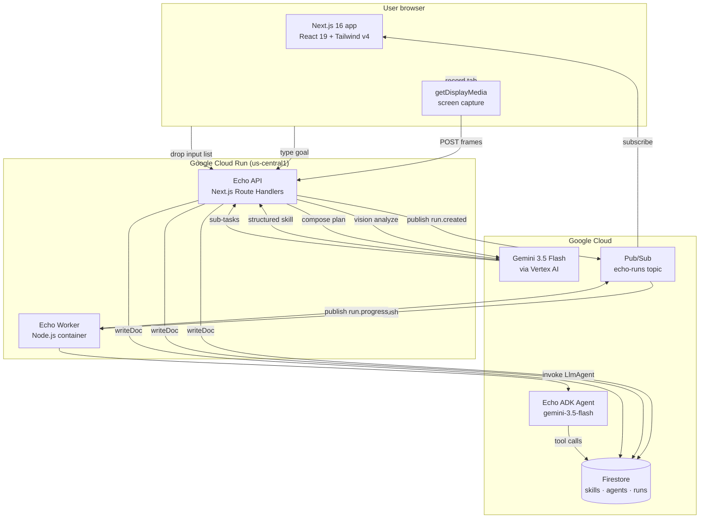

# Echo — Architecture

> The Taskmaster agent's runtime: from a single screen recording, fan out to many parallel skill executions on real Google Cloud infra.

## High-level



## Components

### 1. Browser (`src/app/`)
- **Screen capture** uses `navigator.mediaDevices.getDisplayMedia({ preferCurrentTab: true, selfBrowserSurface: 'include' })`. Canvas snapshots every 2s, encoded as base64.
- **Client state** is React 19 server components + selective `"use client"` for the Composer, Recorder, and Run progress dashboard.
- **Motion** is GSAP (`Reveal`, `StaggerReveal`, `Parallax`, `CountUp`, `Marquee`) + framer-motion (`WordsPullUp` on the hero). All honor `prefers-reduced-motion`.

### 2. API layer (`src/app/api/`)
Three routes, all Gemini-first with mock fallbacks so the demo works without a key:

| Route | Method | Backing | Persists to |
|---|---|---|---|
| `/api/skills/reconstruct` | POST | `@google/genai` (HTTP) | Firestore `skills` |
| `/api/agents/compose` | POST | `@google/genai` (HTTP) | Firestore `agents` |
| `/api/agents/run` | POST + GET | `@google-cloud/vertexai` ADK agent | Firestore `runs/{id}` + Pub/Sub `echo-runs` |

### 3. GCP integration (`src/lib/gcp.ts`)
Lazy-initialized clients:
- **Firestore** — collections: `skills`, `agents`, `runs/{id}/events`
- **Pub/Sub** — topic: `echo-runs`

Auth: **Application Default Credentials (ADC)**. No JSON key file required. Resolution order:
1. `GOOGLE_APPLICATION_CREDENTIALS_JSON` (Vercel serverless) → written to a temp file at boot
2. `GOOGLE_APPLICATION_CREDENTIALS` (file path)
3. `gcloud auth application-default login` (local dev)
4. Cloud Run runtime service account (production)

All write paths are best-effort: a GCP failure logs a warning but never breaks the response. The mock fallback remains fully functional.

### 4. ADK agent (`src/lib/agents/echo-agent.ts`)
`LlmAgent`-style: Gemini 2.5 Flash with a system prompt that constrains it to a `thought | tool_call | final_answer` JSON response schema, plus a streaming `AsyncGenerator` for progress events. In production, this same agent runs in a Cloud Run worker subscribed to Pub/Sub.

### 5. Cloud Run container (`Dockerfile`)
Multi-stage build:
- `deps` — `pnpm install --frozen-lockfile`
- `builder` — `pnpm build` → `.next/standalone`
- `runner` — `gcr.io/distroless/nodejs20-debian12` (~150MB), runs `server.js` as non-root, listens on `:8080`

### 6. Cloud Build pipeline (`cloudbuild.yaml`)
On push to `main`:
1. `docker build` with cache-from `:latest`
2. `docker push` to Artifact Registry `us-central1-docker.pkg.dev/echo-hackathon-2026/echo/echo`
3. `gcloud run deploy` with concurrency 80, 0–10 instances, secrets pulled from Secret Manager

## Data model

```
Firestore
├── skills/                       (reconstructed skills, one doc per skill)
│   └── {skillId}                 → { suggestedName, steps, triggers, ... }
├── agents/                       (composed plans, one doc per composition)
│   └── {agentId}                 → { goal, subtasks, totalEstTime, ... }
└── runs/                         (one doc per agent run)
    └── {runId}                   → { skillId, totalInputs, status, startedAt, ... }

Pub/Sub
└── projects/echo-hackathon-2026/topics/echo-runs
    ├── run.created               → { runId, skillId, totalInputs }
    ├── run.progress              → { runId, progress, total }
    └── run.completed             → { runId, results, totalTime }
```

## Why this stack

- **Web-only, no Electron** — `getDisplayMedia` is the browser-native screen capture API. One binary, works on Mac + Windows + Linux.
- **Next.js 16 + React 19** — Server Components keep initial HTML small (good for demo video frame extraction), Route Handlers co-locate the API with the UI.
- **Gemini 3.5 Flash for everything** — fast + cheap + supports structured output, vision, and tool calling through one model. Good fit for an "agent that does real work" demo.
- **Application Default Credentials** — production-grade auth path, no JSON key files to leak, works identically on Cloud Run, Vercel, and local dev.
- **Cloud Run, not GKE** — auto-scales to zero, no cluster ops. The task is bursty (one record, then 1000s of input runs), perfect fit.
- **Firestore + Pub/Sub, not Cloud SQL + Kafka** — both are serverless, both autoscale, both have first-party Node SDKs. The data model (documents + events) is a natural fit.
